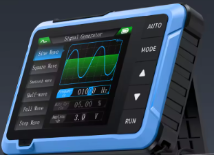
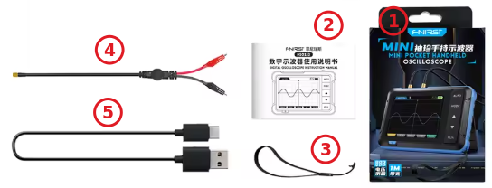
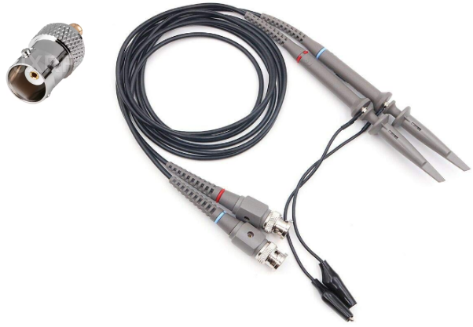
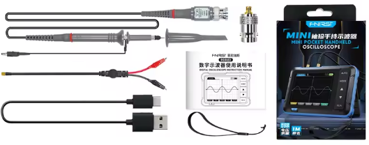

El "DSO152" es un osciloscopio portátil práctico y económico lanzado por la empresa [FNIRSI](https://www.fnirsi.com/es), muy apropiado para mantenimiento, la investigación y la educación.

El osciloscopio tiene una frecuencia de muestreo en tiempo real de 2,5 MS/s (Ver nota), un ancho de banda de 200 kHz y funciones de disparo (trigger):

* Single (único o disparo único). El equipo espera a que llegue la señal exacta, captura  una vez la onda, congela esa imagen en la pantalla y se detiene.
* Normal (disparo normal). Es una función donde la pantalla solo se actualiza y muestra una traza cuando la señal de entrada cumple exactamente con la condición de voltaje y flanco que tú has configurado. Si no hay señal o no alcanza ese nivel, la pantalla se congela o se queda en blanco, a diferencia del modo automático que dibuja una línea de referencia de todos modos.
* Automatic (disparo automático o modo Auto). Es una función que muestra una señal en la pantalla de forma continua. Si la señal cumple la condición de disparo (trigger), se sincroniza con ella; si no la cumple tras un tiempo de espera, el aparato dispara el barrido a la fuerza para que siempre veas una traza en pantalla.

!!! Question ""
    !!! Note "Nota:"
        * La frecuencia de muestreo en **MS/s** indica cuántos millones de valores captura el osciloscopio digital por segundo. Un valor de 50 MS/s significa que el aparato toma 50 millones de lecturas cada segundo, permitiendo reconstruir la forma de onda en la pantalla con mayor o menor detalle.
        * **MS/s** son las siglas de *Mega Samples per second* (Mega muestras por segundo) y representa la velocidad del conversor analógico a digital (ADC). A mayor cantidad de MS/s, más fiel es la señal digitalizada y menor es el espacio de tiempo entre cada punto capturado.

Se puede utilizar libremente tanto para señales analógicas periódicas como para señales digitales no periódicas, y puede medir tensiones de hasta ±400 V. Equipado con una eficiente función AUTO de una sola tecla, puede mostrar la forma de onda medida sin necesidad de ajustes complicados.

Cuenta con una pantalla LCD de alta definición de 2,8 pulgadas con una resolución de 320×240 pixeles. Incorpora una batería de litio de 1000 mAh, que permite un uso continuo de aproximadamente 4 horas tras una carga completa.

{.center-img75}

En su versión estándar el artículo incluye los elementos que vemos en la imagen siguiente:

{.center-img75}

* **1.** Caja con todos los elementos
* **2.** Manual de usuario en varios idiomas (no incluye el español)
* **3.** Brida de transporte segura
* **4.** Sonda con conector MCX (conector micro coaxial de radiofrecuencia en miniatura con un sistema de cierre a presión snap-on) en un extremo y pinzas de cocodrilo en el otro.
* **5.** Cable USB-A / USB-C para cargar la bateria.

!!! Question ""
    !!! Note "Nota:"
        El conector MCX permite conectar y desconectar la sonda con rapidez y presenta una impedancia que comunmente es de 50 ohmios, tiene un funcionamiento estable desde corriente continua hasta frecuencias de 6 GHz y su diseño mecánico funciona mediante mecanismo de ajuste a presión tipo push-pull.

        Existen adaptadores de MCX a BNC que permiten el uso del osciloscopio con las tradicionales sondas x1 y x10.

        {.center-img75}

Existe una versión comercial que incluye todos los componentes:

{.center-img100}
